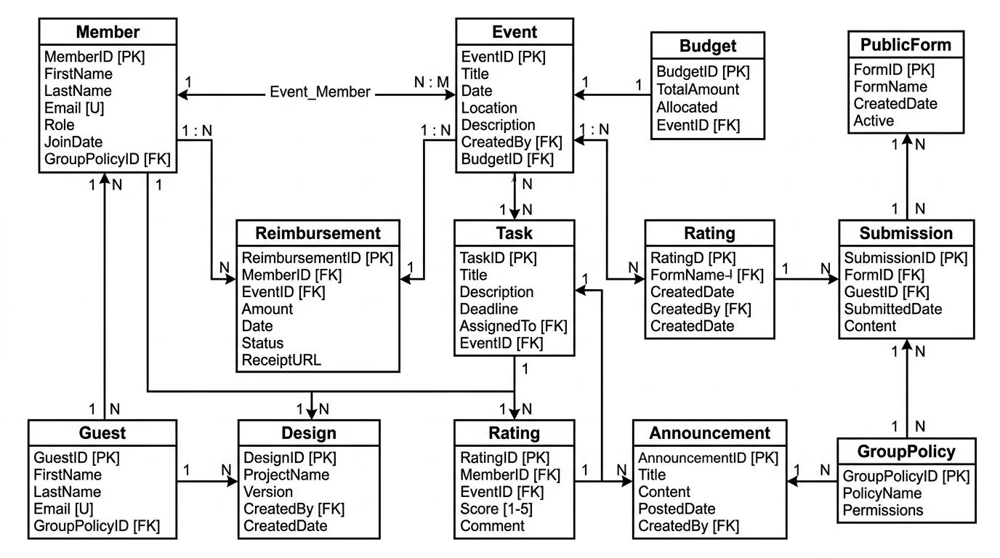
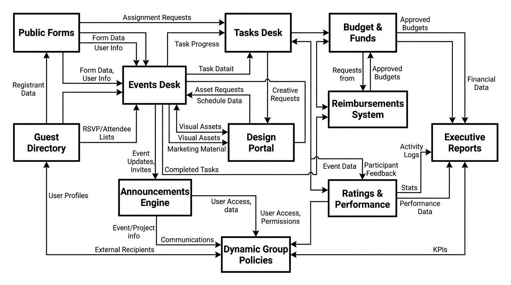
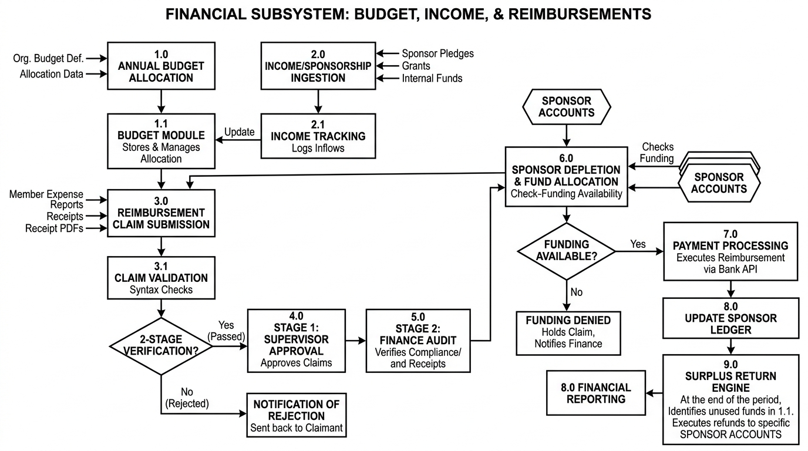
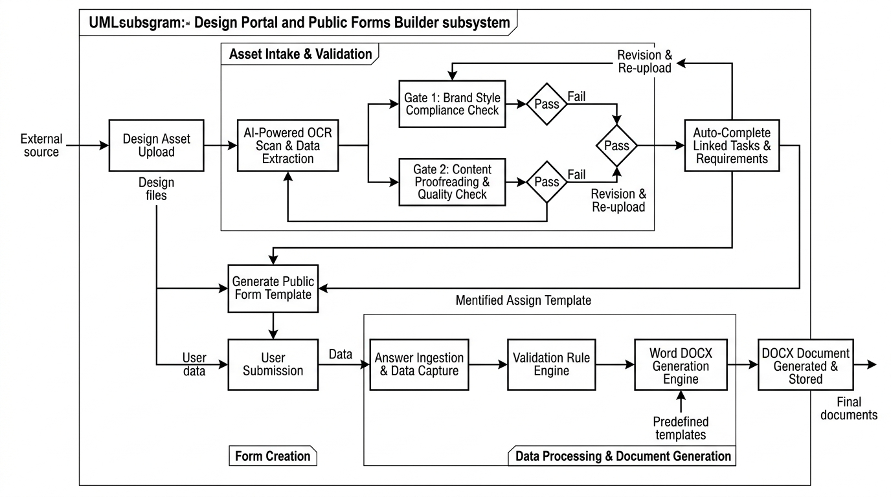

# LEADS Next Gen All-in-One Dashboard

**Private internal operations and management ERP for the LEADS Next Gen Centre at M.S. Ramaiah University of Applied Sciences (MSRUAS), Bengaluru.**

This platform replaces a scattered mix of WhatsApp groups, spreadsheets, and email threads with a single, role-gated portal covering task traceability, event lifecycle management, dual-gate performance evaluation, two-stage reimbursement pipelines, dynamic public form building, financial governance, and full member/guest roster management for roughly 140 people across 7 access tiers.

> This is a **private** repository and application. It is not a public product — access is restricted to LEADS Next Gen Centre members and MSRUAS staff.

---

## Table of Contents

- [Project Structure](#-project-structure)
- [Tech Stack](#-tech-stack)
- [Getting Started](#-getting-started--first-time-setup)
- [One-Time Initial Setup Wizard](#-one-time-initial-setup-wizard)
- [Environment Variables](#-environment-variables)
- [Module Breakdown](#-module-breakdown)
- [Access Level Tiers & Privileges Matrix](#-access-level-tiers--privileges-matrix)
- [Super User Features](#-super-user-features)
- [Self-Hosted Deployment (Hostinger KVM VPS)](#️-self-hosted-deployment-hostinger-kvm-vps)
- [Data Persistence & Encryption](#-data-persistence--encryption)
- [System Architecture & Engineering Diagrams](#-system-architecture--engineering-diagrams)
- [UI Aesthetics & Light Mode Styling](#-ui-aesthetics--light-mode-styling)
- [Comprehensive Operations Manual](#-comprehensive-operations-manual)
- [Intellectual Property & Licensing Notice](#️-intellectual-property--licensing-notice)

---

## 📂 Project Structure

```
ERP/
├── leads-dashboard/        # Next.js 16 (App Router) + TypeScript + Tailwind CSS v4 — the live application
│   ├── src/app/             # App Router routes: dashboard pages, public form pages, and the api/ backend
│   ├── src/components/      # Shared React components
│   ├── src/lib/              # Permissions engine, email service, encryption, data access layer
│   ├── scripts/              # setup-superuser.js, decrypt-backup.js
│   └── public/                # Static assets (logos, reference images)
├── PROJECT DOCS/            # Product specifications: PRD, sitemap, design system, tech spec, data model (ERD), copy, reports/analytics
├── REFERENCE DATA/          # Official MSRUAS leadership directory, hierarchy structure, source images
├── docs/                     # Engineering manuals, deployment guides, DB/module diagrams, the Operations & Privileges Manual (DOCX)
├── demo/                     # Static demo page
├── scripts/                  # Repo-level helper scripts (e.g. manual DOCX generator)
└── deploy.sh                 # Deployment helper script
```

- **`leads-dashboard/`**: The Next.js 16 (App Router) + TypeScript + Tailwind CSS v4 project containing the active implementation of the dashboard.
- **`PROJECT DOCS/`**: Curated product specifications, sitemaps, database models, technical specifications, and copywriting guidelines.
- **`REFERENCE DATA/`**: Official Ramaiah University of Applied Sciences leadership directory, hierarchy structure, source images, and references.
- **`docs/`**: Engineering manuals, deployment guides, database schemas, and the complete [Operations & Privileges Manual (DOCX)](docs/LEADS_ERP_Instruction_and_Privileges_Manual.docx).

---

## 🛠️ Tech Stack

| Layer | Technology |
| :--- | :--- |
| **Framework** | [Next.js 16](https://nextjs.org) (Turbopack, App Router) & [React 19](https://react.dev) |
| **Language** | [TypeScript 5](https://www.typescriptlang.org) (strict mode) |
| **Styling** | [Tailwind CSS v4](https://tailwindcss.com) with a custom glassmorphism design system |
| **Icons** | [Lucide React](https://lucide.dev) |
| **Cryptography** | Node.js `crypto` — `scrypt` (password hashing), `AES-256-GCM` (data-at-rest encryption), `PBKDF2` |
| **Charts & Visualization** | [Recharts](https://recharts.org) |
| **PDF & QR Engines** | `jspdf`, `jspdf-autotable`, `qrcode`, `html2canvas` |
| **Document Export** | `jszip`, `adm-zip`, `archiver` (Word DOCX / ZIP report generation) |
| **OCR & Spellcheck** | `tesseract.js`, `nspell`, `dictionary-en` / `dictionary-en-gb` |
| **Email Relay** | `nodemailer`, routed through a local Postfix relay |
| **Animation** | `gsap`, `ogl` |
| **Sanitization** | `isomorphic-dompurify` |

---

## 🚀 Getting Started & First-Time Setup

### Prerequisites

- Node.js 20+ and npm
- Git

### 1. Clone & Install

```bash
git clone <repository-url>
cd ERP/leads-dashboard

npm install
```

### 2. Configure Environment Variables

Copy the example environment file and fill in your SMTP relay details (see [Environment Variables](#-environment-variables) below):

```bash
cp .env.example .env
```

### 3. Run the Development Server

```bash
npm run dev
```

Open [http://localhost:3030](http://localhost:3030) in your browser (the dev server is configured to run on port `3030`).

### Available Scripts

| Command | Description |
| :--- | :--- |
| `npm run dev` | Start the Next.js development server (Turbopack) on port 3030 |
| `npm run build` | Build the production bundle |
| `npm run start` | Start the production server on port 3030 |
| `npm run lint` | Run ESLint |
| `npm run setup` | Run the CLI Super User bootstrap script (`scripts/setup-superuser.js`) |
| `npx tsc --noEmit` | Run a TypeScript compilation check without emitting output |

---

## 🪄 One-Time Initial Setup Wizard

On a fresh installation (locally or on a production VPS), the application automatically detects that no accounts exist and enters the **One-Time Initial Setup Wizard**:

1. **Step 1: Super User Account Provisioning**
   - Enter the root Super User's Full Name, Email Address, and Master Password (min 8 characters).
   - The password is cryptographically hashed using **scrypt** with a random per-user salt.
   - The instance starts clean with **zero hardcoded members**.
2. **Step 2: Database Server-Side Encryption Key (`DATA_ENCRYPTION_KEY`)**
   - Automatically generate a cryptographically strong 256-bit hexadecimal key (or enter a custom passphrase).
   - The key is saved permanently to `.env` on the server and used to encrypt all local database collections via **AES-256-GCM**.
   - A backup alert reminds the operator to store this key in a secure offline password manager.

> **Permanent Lock:** Once the initial setup is completed, the wizard is permanently locked. Future visitors to `/` or `/setup` are taken straight to the normal Sign-In portal.

Alternatively, CLI operators can run the bootstrap script directly in their terminal:
```bash
npm run setup
# or: node scripts/setup-superuser.js
```

---

## 🔑 Environment Variables

Configuration lives in `leads-dashboard/.env` (copy from `leads-dashboard/.env.example` to start). Key variables:

| Variable | Description |
| :--- | :--- |
| `DATA_ENCRYPTION_KEY` | 256-bit hex key used for AES-256-GCM encryption of all local database collections. Auto-generated by the setup wizard; back it up offline. |
| `SMTP_HOST` / `SMTP_PORT` | Local Postfix submission target. Defaults (`localhost:25`) are correct for the standard "Postfix as a local relay" VPS setup and normally don't need changing. |
| `ANNOUNCEMENT_FROM_EMAIL` | Sender address for outbound mail. Must match (or be a verified Workspace "Send As" alias of) the Gmail account Postfix authenticates as. |
| `ANNOUNCEMENT_FROM_NAME` | Display name used on outbound institutional email. |

> The actual Gmail App Password used for relaying is **never** stored in `.env` — it lives only in Postfix's own SASL configuration on the server.

---

## 📦 Module Breakdown

### Workspace & Operational Modules

#### 1. Dashboard Home (`/dashboard/home`)
- **Executive Overview**: Centralized operations desk featuring friendly user greetings, official designation and committee breakdowns, active task counters, upcoming event schedules, and recent announcements.
- **Cross-Module Project Timeline (Gantt)**: One bar per event spanning its start/end dates (colored by planned/active/completed/archived status), with diamond markers for that event's tasks plotted at their due date, plus an "Other Deliverables" row for tasks not tied to any event. Bars and markers deep-link straight into the Events and Tasks modules. A 2-Weeks / 30-Days / 90-Days window toggle keeps it legible, with a "Today" line and a frozen label column — and it auto-widens to 90 days on its own the moment the default window comes up empty, rather than showing a blank chart. Events with a separate **Planning Start Date** (see Events Desk below) render a lighter, dashed lead-in segment ahead of the event's own solid bar.
- **Quick Action Hub**: Direct shortcuts for event creation, task assignment, design uploads, and announcement broadcasting.
- **Personal Deliverables**: Tailored dashboard widget highlighting deliverables assigned specifically to the logged-in user.

#### 2. Calendar Module (`/dashboard/calendar`)
- **Inter-Campus Operational Timeline**: Interactive calendar displaying event schedules, sub-committee milestones, and university deadlines.
- **Planning-Phase Markers**: Days that fall inside an event's pre-event planning window (its Planning Start Date up to its actual Start Date) are marked with a distinct amber indicator, separate from the event's own on-ground date highlight — so prep work in the lead-up to an event is visible on the calendar even before the event itself begins.
- **Campus Filtering**: Filter view by **GG Campus**, **RTC Campus**, or **All Campuses**.
- **Event Highlights**: Clickable event cards showing start/end dates, venue details, committee leads, and status badges.

#### 3. Events Desk (`/dashboard/events`)
- **Lifecycle Management**: End-to-end event workflow: *Draft* → *Pending Approval* → *Published* → *Completed*.
- **Planning Start Date vs. Event Date**: Every event can optionally carry a separate **Planning Start Date** — when prep work (bookings, committee formation, design briefs, sponsor outreach) actually begins — distinct from its real Start/End Date on the ground. An event can be created and shared early (e.g. planning starting in February) while its actual on-campus dates sit later (e.g. March), without misrepresenting when the event itself runs. Shown as a "Prep work from ..." note on event cards, the event detail page, and the dashboard's Upcoming Events list, and as a distinct lead-in segment on the dashboard Gantt timeline and a separate marker on the Calendar.
- **Status Filter Tabs**: Filter the events grid by *All Events*, *Ongoing*, *Completed*, or *Archived* — computed from each event's actual end date, not just its stored status, so a past-dated event reads as completed even if nobody manually flipped it.
- **Sub-Committee Formation**: Create specialized committees (Logistics, Technical, Media, Operations) and assign member rosters.
- **Bulk Roster Import**: Download a CSV template and bulk-upload events, same pattern as the Member Directory and Guest Directory importers.
- **Approval Engine**: Event creation by Executive Council members (President, VP, Chief Coordinator) automatically triggers a Centre Head sign-off requirement.
- **Festivals & Observances Approval Gate**: Synced Indian national holidays and observances require explicit social media post sign-off (`holiday_social_approval`). Until a festival's post is approved and moved to content design (`holiday_design_social`), the festival event is hidden from event selection dropdowns across all dashboard modules.
- **Student Performance Evaluation**: Integrated dual-gate rating system for Centre Head and campus-specific Events Heads.

#### 4. Tasks Desk (`/dashboard/tasks`)
- **Task Delegation**: Assign tasks to individual members or entire sub-committees with priority tagging (*Urgent*, *High*, *Normal*, *Low*).
- **Searchable Student & Event Filters**: The Student and Event filter dropdowns are type-to-search comboboxes rather than plain scroll-to-find `<select>` lists — matches the "Select Assignee" search pattern already used when creating a task.
- **Status Tracking**: Visual progress pipeline: *To Do* → *In Progress* → *Under Review* → *Completed*.
- **Auto-Generated Design Tasks**: A finalized Design Portal submission (style-approved, and proofread-approved if proofreading was requested) automatically creates or completes a task here — linked to its event when tagged to one, or standalone otherwise — so it flows straight into the rating queue with no manual re-entry.
- **Extension Requests**: Assignees can submit task deadline extension requests, which Faculty Advisors or the Centre Head can approve or reject.
- **Executive Task Allotment & Universal Visibility**: Executive Council leadership (President & Vice President) hold complete platform-wide task visibility access to monitor all assigned tasks, while new executive task assignments route through Event Head approval.
- **Live Gantt Sync**: A task's due date drives its marker position on the dashboard's Project Timeline — assign, reschedule, or complete a task and the Gantt chart reflects it on the next data sync, no separate step required.

#### 5. Ratings & Student Performance (`/dashboard/ratings`)
- **Rubric Evaluation**: 5-point performance scoring system for student deliverables and leadership contributions.
- **Searchable Student & Event Filters**: Same type-to-search combobox as the Tasks Desk, applied to the Task Evaluation Queue's Student and Event filters.
- **Time Period Filter**: Filter the evaluation history by a specific month or a custom date range — no fixed quarters.
- **Scoped Visibility**:
  - *Super User / Centre Head*: Universal visibility across all members and campuses.
  - *Department Heads*: Visibility over team members in their department.
  - *Executive Council*: Visibility over own performance and committees they belong to.
  - *Alumni*: Restricted strictly to viewing their own historical performance ratings.

#### 6. Design Portal (`/dashboard/designs`)
- **Asset Review Desk**: Dedicated portal for Design and Social Media department asset requests, proofreading, and approval workflows.
- **Proofreading Pipeline**: Upload design files, assign proofreaders, and manage review decisions (*Approved*, *Revisions Requested*, *Pending Proofread*). Feedback/comments are only required when requesting changes or rejecting — a plain approval doesn't need typed justification.
- **Design Style Approval**: A separate Design Head/Centre Head sign-off (*Style Approved* / *Style Rejected*) on top of proofreading — once both gates clear (or style alone, if proofreading wasn't requested), the design is finalized and its linked task completes automatically.
- **Asset Replacements**: Support for uploading updated asset revisions while retaining review logs.
- **Scoped Access**: Restricted to Design Head, Super User, and assigned proofreaders.

### Administration & Governance Modules

#### 7. Reimbursements System (`/dashboard/reimbursements`)
- **Expense Claims**: Member expense submission desk with receipt proof attachments and amount validation.
- **Two-Stage Approval Pipeline**:
  - **Stage 1 (Sector Head)**: Initial operational verification.
  - **Stage 2 (Finance Head)**: Final financial audit and reimbursement sign-off.
- **Visibility Isolation**: Claimants view own claims; Sector Heads view all pending Stage 1 claims; Finance Heads view claims only after Stage 1 verification.

#### 8. Budget & Funds (`/dashboard/budget`)
- **Financial Governance**: Ledger for university fund allocations, department budgets, and operational expenditures.
- **Income Sources & Sponsorships**: Track external corporate sponsors, research/institutional grants, alumni donations, and general Centre income. Income sources can be linked to specific events or assigned as General Centre Income.
- **Smart Sponsorship Calculation Engine**:
  - *Sponsor Depletion First*: Event expenses automatically deplete linked event sponsor funds first before touching the Centre's main budget allocation.
  - *Centre Budget Fallback*: Any expenses exceeding total sponsorship are deducted from the Centre's main account.
  - *Sponsor Surplus Return Rule*: If actual event spending is less than sponsorship received, unused sponsor funds automatically return to the Centre's main account, increasing the Centre's total available balance.
  - *Total Available Capital*: Real-time financial formula: `Annual Approved Budget + General Income/Grants + Returned Sponsor Surplus`.
- **Multi-Year Budgeting Engine**: Extended Financial Year selector allowing proposing, reviewing, editing, and inspecting budgets across a 9-year range (`-5` years back to `+3` years forward) for historical access and multi-year forward planning.
- **Financial Analytics & Metric Dashboard**: 6 real-time stat cards (Annual Approved Budget, General Income & Grants, Sponsor Surplus Returned, Total Available Capital, Realized Net Spent, Net Remaining Balance) along with event line-item badges (`🤝 Depleted` and `🔄 Returned to Centre`).
- **Encrypted API Data Layer**: Fully backed by AES-256-GCM encrypted server collection persistence via `/api/income-sources` and `/api/income-sources/[id]`.
- **Access Scoping**: Restricted strictly to Super User, Centre Head, and Finance Leadership.

#### 9. Public Forms Builder (`/dashboard/forms` & `/forms/[slug]`)
- **Interactive Form Builder**: Custom form creation engine for student signups, feedback collection, and event registrations.
- **QR Code Preview & Download**: Instant QR Code preview generated for every public form (`/forms/[slug]`), with a single-click download of a high-resolution PNG poster card (featuring official branding header, event title, scannable QR code, and URL string) for physical printing and distribution, plus direct browser printing.
- **Reusable Field Templates & "Start from Template"**: Save any form's field schema as a reusable template, then start a future form from it via the **Start from Template** picker instead of rebuilding it field-by-field. Server-side, the built-in templates (below) are guaranteed present and kept in sync with their code-defined field list on every boot — even on a database that predates the template shipping — so the picker never silently comes up empty.
- **Feedback Form Template & Word Export**: A built-in template matching the Centre's official `Feedback_Events.docx` field-for-field — Name/Type of Event, Date/Duration, Participant details, the 9-parameter 1–5 rating grid, Learning Outcomes, four open-ended questions, and the Outcome & Impact section. Every submission to a form built from this template can be downloaded as a filled copy of the real Word document (same header, layout, and branding as the official form), with every answer placed exactly where it would be hand-written — ticked scale boxes, checked event types, filled blanks — plus a footer disclaimer noting the response was completed and verified through the LEADS Operational Portal, so no physical copy needs to be filled or signed.
- **Event Linking**: Tag a form to a specific event — shown as a badge in the builder and on the public form page itself.
- **Field Customization**: Text inputs, textareas, dropdowns, checkboxes, and file upload fields.
- **Public Form Slugs**: Custom public landing pages rendered at `/forms/[slug]` — the only routes in the app reachable without authentication.
- **Form Protection**: Deletion of public forms is strictly restricted to Centre Head and Super User.

#### 10. Analytics & Reports (`/dashboard/reports`)
- **Executive Report Generator**: Styled PDF report generation and CSV data exports.
- **Report Types**: Performance scorecards, event post-mortems, financial audit summaries, and member activity reports.
- **Time Period Filter**: Scope any report to a specific month or a custom date range instead of a fixed quarter.

#### 11. Announcements Engine (`/dashboard/announcements`)
- **Targeted Broadcasting**: Multi-scope message delivery (`ALL_MEMBERS`, `CORE_COMMITTEE`, `DEPARTMENTS`, `INDIVIDUAL`).
- **Dual Notification**: In-dashboard bell alerts combined with automated Light Mode HTML email dispatch.
- **Authoring Rules**: Allowed for Leadership, Core Committee, and Heads; blocked for Alumni & Executive Council without approval.

#### 12. Member Directory & Roster (`/dashboard/directory`)
- **Central Roster**: Complete roster management covering Advisory Board, Core Committee, Training Associates, and Alumni.
- **Bulk Roster Import**: Download a CSV template and bulk-upload members.
- **Tier & Persona Control**: Manage Tiers 1 through 7, roles, divisions, and departments.
- **Status Controls**: Active vs. Terminated account status toggles — restricted to the Centre Head, and requires a typed reason for the record.
- **Automated Termination Email**: Terminating a member automatically dispatches an official notification email (including the stated reason) to their registered address, retaining historical records in the database.
- **Member Protection**: Member removal and termination controls are strictly blocked for Executive Council roles.

#### 13. Guest Directory (`/dashboard/guest-directory`)
- **External Contact Cards**: Directory for visiting guests, external VIPs, faculty advisors, and industry partners.
- **Bulk Roster Import**: Download a CSV template and bulk-upload guests, same pattern as the Member Directory.
- **Access Scoping**: View and add contacts allowed for Executive Council, Centre Head, and Faculty; contact deletion restricted to Centre Head and Super User.

#### 14. Guest Invites Dispatcher (`/dashboard/guest-invites`)
- **Mass Email Dispatcher**: Batch invitation engine for official events and guest communications.
- **Mail-Merge Engine**: Dynamic placeholder substitution (`{{name}}`, `{{email}}`, `{{role}}`).
- **Delivery Monitoring**: Progress tracking bar with real-time success and failure reporting.

#### 15. Dynamic Group Policies (`/dashboard/policies`)
- **Granular RBAC Engine**: Super User authority to grant any of 15 capability keys (`EVENTS_CREATE`, `TASKS_EDIT`, `EDIT_DIRECTORY`, `BUILD_FORMS`, etc.).
- **Quick Selection Controls**: Integrated **Select All** and **Select None** controls for capabilities/privileges, divisions, and tiers.
- **Targeting Matrix**: Target by Member ID, Division, Tier, or Designation Keyword.
- **Approval Gateways**: Configure optional approval sign-offs (Centre Head, specific member, policy tag holder).
- **Scope Restrictions**: Apply `OWN_ONLY` visibility restrictions to specific users or tiers.

#### 16. Backup & Restore (`/dashboard/backup`)
- **Database Snapshot Manager**: Export complete system state to formatted JSON backup files.
- **System Restoration**: Restore database state with validation checks, rollback protection, and backup history logs.

#### 17. Email Management & Client (`/dashboard/email`)
- **SMTP Client Configuration**: Configure Nodemailer for Google Workspace SMTP, Local Postfix, or Custom SMTP.
- **Diagnostics & Testing**: Live connection verification tool with instant test mail delivery.
- **Dispatch Logs**: Detailed audit log of all sent and failed email notifications.
- **Master Light Mode Template Engine**: Centralized HTML email wrapper styling.

#### 18. System & Account Settings (`/dashboard/settings`)
- **Personal Profile**: Profile customization and password updates.
- **Profile Photo Upload**: Upload a profile photo (max 2 MB) — shows immediately in the header, sidebar, and Settings itself.
- **Secure Email Update**: Updating login email sends a 5-minute OTP code to the CURRENT email inbox for security verification.
- **Emergency System Lockdown**: Super User toggle to lock the dashboard site-wide (renders plain 404 for non-admin session attempts).

Settings is also reachable directly from the dashboard header: clicking the name/avatar in the top navbar opens a dropdown with **Settings** and **Sign Out**, alongside the sidebar's own links.

---

## 🔐 Access Level Tiers & Privileges Matrix

The system enforces a multi-tiered permission model backed by dynamic policy grants (`leads-dashboard/src/lib/permissions.ts`):

| Tier | Role Title | Typical Division | Core Permissions & Scope |
| :--- | :--- | :--- | :--- |
| **Tier 1** | **Super User** | Core Committee | Complete system governance, dynamic Quick Switch impersonator, system lockdown, global audit logs, backup/restore. |
| **Tier 2** | **Centre Head** | Faculty | University-wide operational authority, final budget sign-off, Level-2 reimbursement clearance, email broadcasts, guest directory. |
| **Tier 2.5** | **GG Campus Head** | Faculty | Regional operational authority and event oversight for the Gnanagangothri (GG) campus; cross-campus full view, edit, and evaluation authority over both **GG Campus** and **RTC Campus** events. |
| **Tier 3** | **Faculty / Event Heads** | Faculty | Event proposal approval, Level-1 reimbursement audit, student task lead delegation, rating reviews, campus-restricted student evaluation (RTC Events Head manages RTC Campus only). |
| **Tier 4** | **Advisory Board** | Faculty | Read-only access to institutional analytics, event summaries, and evaluation reports. |
| **Tier 5** | **Core Committee** | Core Committee | Executive Council (President & Vice President) hold universal task oversight across the platform; Event orchestration, task assignments, public form builder & QR generation, financial claims. Event creation requires **Centre Head approval**; task allotment requires **Event Head approval**. Member termination is strictly blocked. Festival events require post sign-off to appear in dropdowns. |
| **Tier 6** | **Training Associates** | Training Associate | Task execution & status updates, personal workspace, expense claim submission, feedback participation. |
| **Tier 7** | **Alumni / Guests** | Alumni / Guest | Read-only historical event records, own performance ratings, past reimbursements, guest invites, certificate downloads, and profile settings. |

---

## ⚡ Super User Features

- **Dynamic Quick Switch:** The Super User can instantly impersonate any active account in the Directory without entering a password. The switcher queries the live database in real time. A prominent top bar allows one-click return to the Super User session.
- **Emergency Lockdown Mode:** Instantly restricts non-Super-User access in case of administrative maintenance.
- **Encrypted Backup & Restore:** Export complete AES-256 encrypted snapshots of the database with offline decryptor tool (`scripts/decrypt-backup.js`).

---

## 🖥️ Self-Hosted Deployment (Hostinger KVM VPS)

The application runs as a production service under **PM2** on a self-hosted Hostinger KVM VPS at **[leadsnextgencentre.online](https://leadsnextgencentre.online)**, reverse-proxied with **Nginx** and automated SSL.

### Deployment Workflow:
1. Develop, test, and commit locally to git.
2. Push commits to `main`.
3. On the VPS:
   ```bash
   git pull
   npm install
   npm run build
   pm2 restart leads-dashboard
   ```
4. All client browsers synchronize with the VPS over HTTPS.

See [`docs/vps-deployment-guide.html`](docs/vps-deployment-guide.html) and [`docs/vps-setup.sh`](docs/vps-setup.sh) for the full server bootstrap procedure, and [`docs/dns-rebuild-guide.html`](docs/dns-rebuild-guide.html) / [`docs/direct-send-setup-guide.html`](docs/direct-send-setup-guide.html) for DNS and outbound mail configuration.

---

## 🔒 Data Persistence & Encryption

- Database files reside under `leads-dashboard/data/` as per-collection JSON files (`members.json`, `events.json`, `tasks.json`, etc.).
- Each file is encrypted at rest using **AES-256-GCM** using the `DATA_ENCRYPTION_KEY` in `.env`.
- Uploaded assets (Design Portal images, reimbursement receipts) are stored on disk under `data/uploads/`.
- **Live Sync:** Connected clients automatically poll every 7 seconds, pulling live updates into local context.

---

## 📐 System Architecture & Engineering Diagrams

The LEADS ERP platform is designed with a decoupled modular architecture, encrypted persistent JSON data stores, and cross-module data integration pipelines.

### 1. Database Entity-Relationship (ER) Schema


### 2. Module-to-Module Data Flow Architecture


### 3. Individual Subsystem Architectural Flowcharts

| Subsystem Area | Structural Flowchart Diagram | Core Module Connections |
| :--- | :--- | :--- |
| **Events & Tasks Subsystem** |  | Draft validation → Approval queues → Sub-committee rosters → Sponsor merge → Deliverable tracking → Automatic completion triggers. |
| **Finance & Budget Subsystem** |  | Annual budget → Income/Sponsorship ingestion → Claim validation → 2-Stage audit → Sponsor depletion first → Net Centre cost & surplus return engine. |
| **Design & Forms Subsystem** |  | Asset upload → AI OCR scan → Gate 1 Style & Gate 2 Proofread clearances → Task auto-completion → Dynamic form creation → Public sign-ups → Word DOCX template exports. |

Deeper product specification, sitemap, data model (ERD), design system, and content copy documents live in [`PROJECT DOCS/`](PROJECT%20DOCS/).

---

## 🎨 UI Aesthetics & Light Mode Styling

- **Dynamic Inspirational Quotes Carousel**: Auto-rotating hero banner on the login screen (`leads-dashboard/src/app/page.tsx`) cycling through 20 quotes on leadership and inspiring young minds — global and Indian leaders, education advocates, and business leaders — every ~3.5 seconds, with smooth cross-fade transitions (no manual prev/next controls; the dot indicators still allow jumping to a specific quote).
- **Branded Loading Splash**: A centered LEADS logo splash (spinning ring, timed progress bar) shows for 5 seconds after login and for 2 seconds when switching between dashboard modules.
- **Collapsible Sidebar**: The desktop sidebar collapses to an icon-only rail to reclaim page width, and temporarily flies out to full width on hover without shifting the page content underneath. The collapsed/expanded preference persists across reloads.
- **Isometric Light Mode Background**: Custom geometric isometric cube background image (`/images/light-bg.jpg`) rendered fixed across Light Mode layout (`leads-dashboard/src/app/globals.css`).
- **Master Light Mode Email Template**: Institutional HTML email wrapper with clean white cards (`#ffffff`), soft slate borders (`#e2e8f0`), LEADS institutional blue accents (`#0284c7`), and dark slate body text (`#0f172a`, `#334155`) (`leads-dashboard/src/lib/email-service.ts`).

---

## 📄 Comprehensive Operations Manual

A formal Microsoft Word document detailing all workflows, security protocols, and module guidelines is available in the repository:
- **[LEADS ERP Operations & Privileges Manual (DOCX)](docs/LEADS_ERP_Instruction_and_Privileges_Manual.docx)**

Additional engineering references:
- [`docs/bugs-to-fix.md`](docs/bugs-to-fix.md) — known-issue tracker
- [`docs/recommended-fixes.md`](docs/recommended-fixes.md) — proposed engineering improvements
- [`docs/changes-needed-for-claude.md`](docs/changes-needed-for-claude.md) — outstanding work notes for AI-assisted development sessions

---

## ⚖️ Intellectual Property & Licensing Notice

All Intellectual Property, Copyrights, Development Licensing, and Proprietary System Architecture belong exclusively to **Kayomarz Pavri**. Unauthorized copying, distribution, or reproduction of this codebase or its custom components is strictly prohibited.

© 2026 LEADS Next Gen Centre, M.S. Ramaiah University of Applied Sciences. All rights reserved.
